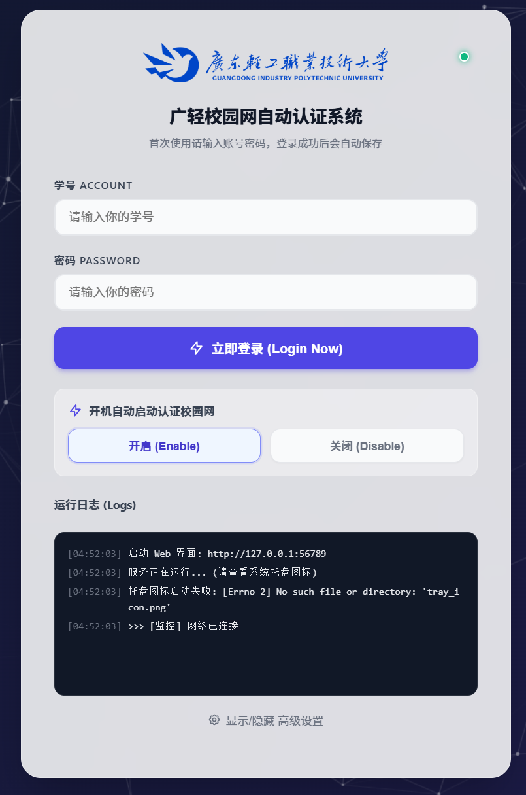

# 广轻校园网自动认证系统 

一个轻量、现代化的校园网自动登录工具，专为广东轻工职业技术大学打造。无需手动配置繁琐的脚本，开箱即用。

> Powered by **ZBZD**
> 
> **⚠️ 注意：目前仅在【南海北校区】测试通过，其他校区暂未验证，不保证可用。**

## ✨ 核心特性

*   **⚡️ 零环境依赖**：完全内置 Python 运行环境自动配置逻辑。只要是 Windows 电脑，双击即用，无需预装 Python。
*   **🎨 现代化 Web 界面**：抛弃简陋的命令行，提供美观的图形化管理界面，支持毛玻璃特效与粒子动画。
*   **🚀 全自动流程**：
    *   **开机自启**：一键设置，开机自动后台运行。
    *   **断网重连**：深度检测网络状态（使用 MIUI/微软 探测接口），断网秒级自动重连，宿舍断电也不怕。
    *   **智能退出**：认证成功后支持自动关闭程序，彻底释放 CPU 和内存占用（轻量化模式）。
*   **🛠 高级控制**：支持自定义服务端口、重置配置、日志实时监控。
*   **🔒 安全**：账号密码仅保存在本地 `config.json`，绝无上传。

## � 如何使用

1.  下载本项目压缩包并解压。
2.  双击运行文件夹内的 **`启动校园网助手.bat`**。
    *   *首次运行时，脚本会自动下载并配置所需的 Python 环境（约 20MB），请耐心等待。*
3.  程序启动后会自动打开浏览器，进入管理页面。
    *   如果浏览器未打开，请在浏览器输入：`http://127.0.0.1:56789`
4.  输入你的**学号**和**密码**，点击 **"立即登录"**。
5.  登录成功！（下次启动会自动登录，无需再次输入）。

## ⚙️ 高级功能说明

在 Web 界面的 "高级设置" 面板中，你可以：

*   **开机自动启动认证校园网**：
    *   开启后，程序会在 Windows 启动目录下创建快捷方式，实现开机静默启动。
*   **断网自动重连**：
    *   默认开启。程序会每隔 5 秒检测一次网络连通性。如果发现断网，会自动尝试重新登录。
*   **认证成功后自动退出程序**：
    *   **推荐开启**。如果你不需要断网重连功能，开启此项后，程序会在确认网络通畅后（约 30 秒内）自动彻底关闭，不占用任何后台资源。
    *   *注：此功能与 "断网自动重连" 互斥，只能开启其中一个。*
*   **服务端口**：
    *   默认端口为 `56789`。如果遇到端口冲突，可以在此修改。

## ❓ 常见问题

**Q: 启动后网页无法打开，或者提示端口占用？**
A: 可能是默认端口 56789 被其他软件占用了。请用记事本打开 `config.json` 文件，找到 `"port": 56789`，将其改为其他数字（如 56790），保存后重启程序即可。

**Q: 双击 bat 后闪退或没反应？**
A: 脚本会自动生成 `debug_log.txt`。请查看该文件内的日志信息。通常是因为网络问题导致 Python 下载失败，或者系统缺少 VC++ 运行库（脚本会提示下载）。

**Q: 登录显示 "Unknown error"？**
A: 请检查账号密码是否正确，或者尝试手动注销一次校园网后再试。

**Q: 程序一直提示 "网络断开"？**
A: 程序使用 `connect.rom.miui.com` 进行网络探测。如果你的网络环境无法访问该地址，可能会误报。

## 🛠 技术栈

*   **Runtime**: Embedded Python 3.10
*   **Backend**: Flask
*   **Network Check**: Requests (MIUI Generate_204)
*   **GUI**: HTML5 + CSS3 (Glassmorphism)

---
